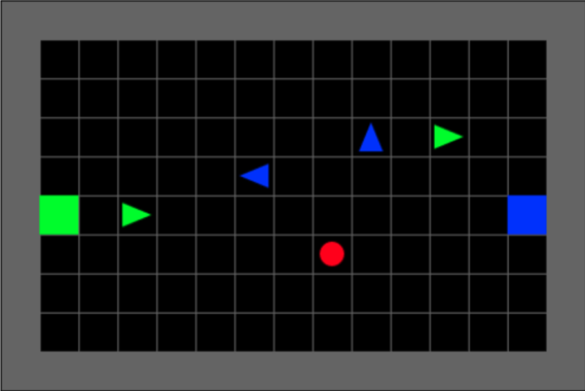
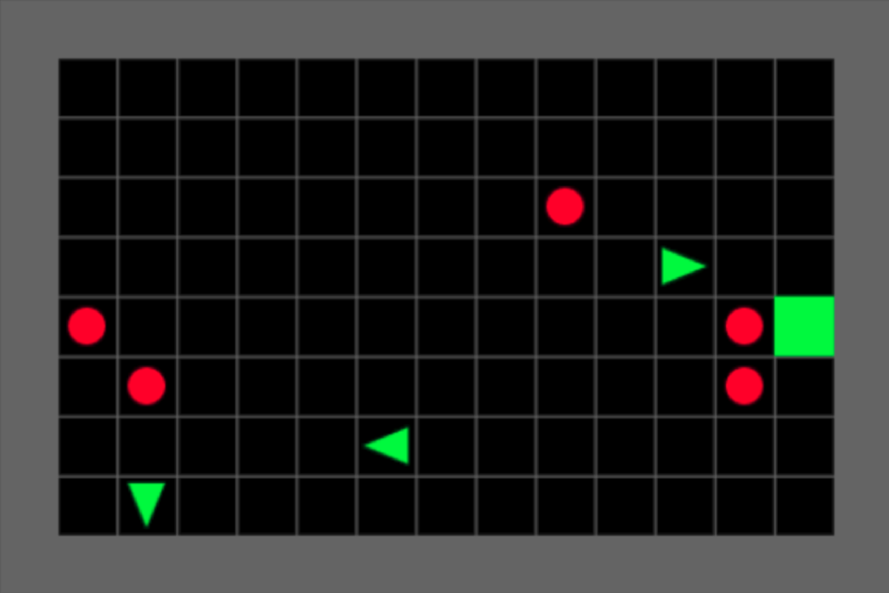
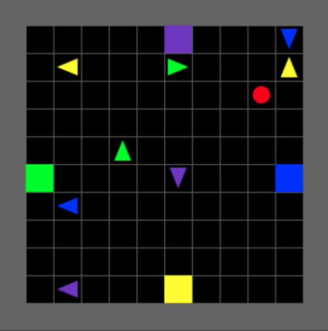
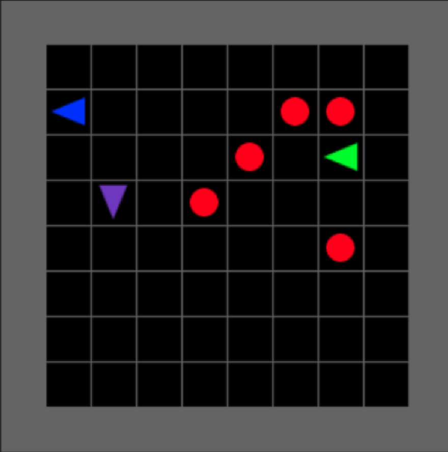
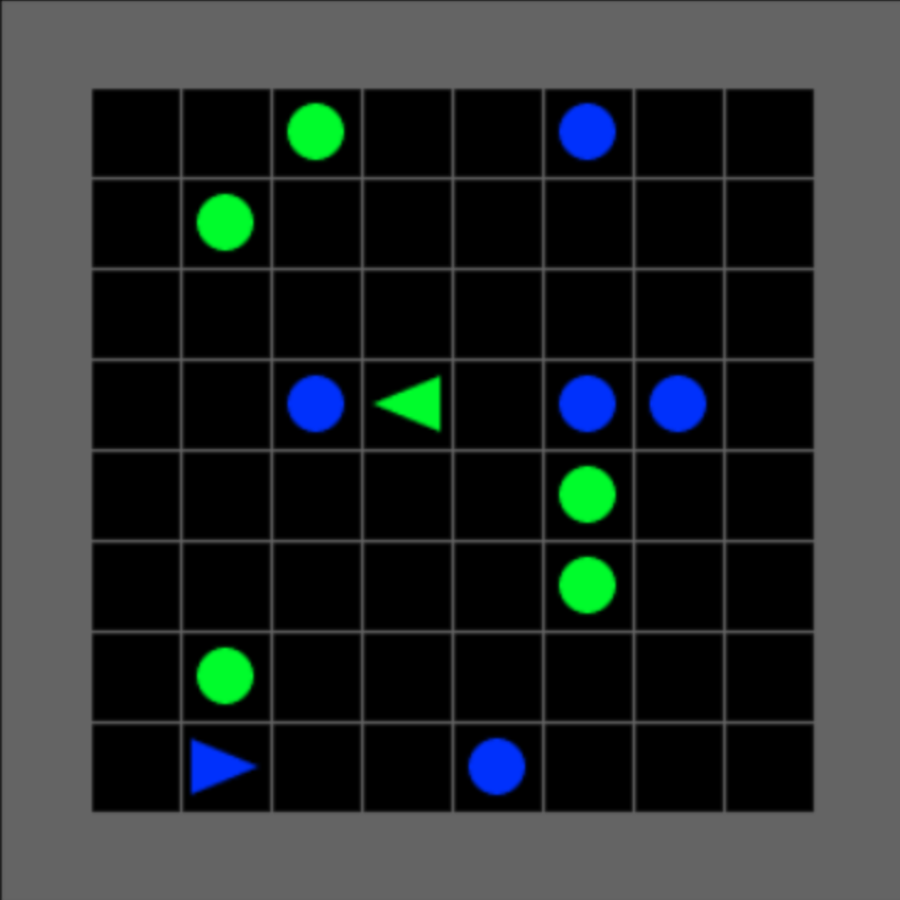

# Multi-Agent Gridworld Environment (MultiGrid)


Lightweight multi-agent gridworld Gym environment built on the [MiniGrid environment](https://github.com/maximecb/gym-minigrid). 

Requirements:
- Python 3.5+
- OpenAI Gym
- NumPy
- Matplotlib

Please use this bibtex if you want to cite this repository in your publications:

```
@misc{gym_multigrid,
  author = {Fickinger, Arnaud},
  title = {Multi-Agent Gridworld Environment for OpenAI Gym},
  year = {2020},
  publisher = {GitHub},
  journal = {GitHub repository},
  howpublished = {\url{https://github.com/ArnaudFickinger/gym-multigrid}},
}
```
## Installation

```
git clone https://github.com/ArnaudFickinger/gym-multigrid
cd gym-multigrid
pip install -e .
```

## Test

```
python test_env.py
```

## Design

The environment can be either fully or partially observable. Each grid cell is encoded with a tuple containing:
- The type of the object (can be another agent)
  - Provided object types are: wall, floor, lava, door, key, ball, box, goal, object goal and agent
- The color of the object or other agent
- The type of the object that the other agent is carrying
- The color of the object that the other agent is carrying
- The direction of the other agent 
- Whether the other agent is actually one-self (useful for fully observable view)

Actions in the basic environment:
- Turn left
- Turn right
- Move forward
- Pick up an object
- Drop the object being carried
- Toggle (open doors, interact with objects)
- Done (task completed, optional)

## Included Environments

Two environments are included.

### SoccerGame

<p align="center">
  
  
  
</p>

Each agent get a positive reward whenever one agent drop the ball in their goal and a negative reward whenever one agent drop the ball in the opposite goal. Each agent can pass the ball to or take it from another agent. The number of teams, number of player in each team, number of goals and number of balls can be easily modified.

### CollectGame

<p align="center">
  
  
</p>

Each agent get a positive reward whenever one agent collect a ball of the same color and a negative reward whenever one agent collect a ball of a different color. The number of balls, colors and players can be easily modified.


